# UI Test Suite Speed-Up: Charts

Generated by `chartgen.py` from `runs.csv` in this same folder - re-run
that script to regenerate this file after `runs.csv` changes.

Mermaid `xychart-beta` diagram - renders natively in GitHub, GitLab, and
VS Code's markdown preview, no image asset or build step required
(Mermaid v10.7+ for `xychart-beta` support).

## Per-directory duration: before vs after (+ total)

"After" values are real averages of the clean repeated runs recorded in
`runs.csv` (excludes any run with a failure/error). "Before" values come
from `runs.csv`'s `baseline` phase: `wunderbaum`'s is a real measured
control run (`git stash`); the other four are estimates read directly
from the pre-conversion `time.sleep()` calls in each file (see the
`notes` column in `runs.csv` - no separate baseline run was captured for
those three). "Total" sums the 5 directories (each run standalone, so
per-directory Playwright/browser startup is counted once per bar - it is
not the same number as a full-suite run, which amortizes that cost once
overall and also includes untouched AI/unit tests).

```mermaid
%%{init: {"themeVariables": {"xyChart": {"plotColorPalette": "#2a78d6, #eb6834"}}}}%%
xychart-beta
    title "Per-directory duration: before vs after (seconds)"
    x-axis ["wunderbaum", "visnetwork", "jsoneditor", "terminalmirror", "usecases", "Total"]
    y-axis "Duration (s)" 0 --> 400
    bar [181, 40, 27, 8, 75, 331]
    bar [29, 16, 7, 2, 19, 73]
```



| directory | before (s) | after (s) | speedup |
| --- | --- | --- | --- |
| wunderbaum | 181.05 | 28.91 | 6.26x |
| visnetwork | 40.00 | 16.02 | 2.50x |
| jsoneditor | 27.00 | 7.24 | 3.73x |
| terminalmirror | 8.00 | 1.62 | 4.94x |
| usecases | 75.00 | 19.18 | 3.91x |
| **Total** | **331.05** | **72.97** | **4.54x** |

## Regenerating

```bash
python3 chartgen.py
```
